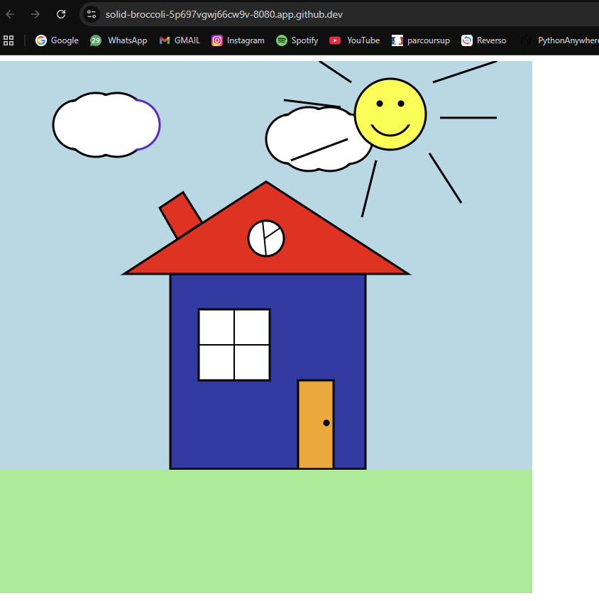

# ATELIER FROM IMAGE TO CLUSTER

## Objectif

L'objectif de cet atelier est d'industrialiser le cycle de vie d'une
application simple en utilisant des outils d'Infrastructure as Code.

Nous avons créé une image Docker personnalisée avec Packer (basée sur
Nginx) contenant un fichier HTML personnalisé, puis nous avons déployé
automatiquement cette application sur un cluster Kubernetes (k3d) à
l'aide d'Ansible.

------------------------------------------------------------------------

## Technologies utilisées

-   Docker
-   Packer
-   Kubernetes (k3d)
-   Ansible
-   GitHub Codespaces

------------------------------------------------------------------------

## Architecture

-   Image Docker personnalisée (Nginx + index.html)
-   Cluster Kubernetes (1 master + 2 workers)
-   Déploiement automatisé avec Ansible
-   Accès via port-forward

------------------------------------------------------------------------

## Étapes réalisées

### 1. Création du Codespace

-   Cliquer sur **Code**
-   Ouvrir un **Codespace**
-   Accéder à un terminal Linux prêt à l'emploi

------------------------------------------------------------------------

### 2. Installation des outils

``` bash
sudo apt update
sudo apt install -y ansible
```

Installation de Packer :

``` bash
wget https://releases.hashicorp.com/packer/1.10.0/packer_1.10.0_linux_amd64.zip
unzip packer_1.10.0_linux_amd64.zip
sudo mv packer /usr/local/bin/
```

------------------------------------------------------------------------

### 3. Création du cluster Kubernetes (k3d)

``` bash
curl -s https://raw.githubusercontent.com/k3d-io/k3d/main/install.sh | bash

k3d cluster create lab --servers 1 --agents 2

kubectl get nodes
```

------------------------------------------------------------------------

### 4. Création de l'image avec Packer

Fichier `nginx.pkr.hcl` :

``` hcl
packer {
  required_plugins {
    docker = {
      version = ">= 1.0.0"
      source  = "github.com/hashicorp/docker"
    }
  }
}

source "docker" "nginx" {
  image  = "nginx:latest"
  commit = true
}

build {
  name    = "nginx-custom"
  sources = ["source.docker.nginx"]

  provisioner "file" {
    source      = "index.html"
    destination = "/usr/share/nginx/html/index.html"
  }
}
```

``` bash
packer init .
packer build .
```

------------------------------------------------------------------------

### 5. Import de l'image dans K3d

``` bash
k3d image import nginx-custom:latest -c lab
```

------------------------------------------------------------------------

### 6. Déploiement AUTOMATISÉ avec Ansible

``` bash
ansible-playbook deploy.yml
```

Le playbook Ansible utilise le module `kubernetes.core.k8s` pour créer
le Deployment et le Service de manière déclarative et idempotente.

### Playbook Ansible (deploy.yml)

``` yaml
- name: Deploy nginx custom on Kubernetes
  hosts: localhost
  connection: local
  vars:
    ansible_python_interpreter: /usr/bin/python3

  tasks:

    - name: Create Deployment
      kubernetes.core.k8s:
        state: present
        definition:
          apiVersion: apps/v1
          kind: Deployment
          metadata:
            name: nginx-custom
            namespace: default
          spec:
            replicas: 1
            selector:
              matchLabels:
                app: nginx-custom
            template:
              metadata:
                labels:
                  app: nginx-custom
              spec:
                containers:
                  - name: nginx-custom
                    image: nginx-custom:latest
                    imagePullPolicy: Never
                    ports:
                      - containerPort: 80

    - name: Create Service
      kubernetes.core.k8s:
        state: present
        definition:
          apiVersion: v1
          kind: Service
          metadata:
            name: nginx-custom
            namespace: default
          spec:
            selector:
              app: nginx-custom
            ports:
              - protocol: TCP
                port: 80
                targetPort: 80
            type: ClusterIP
```

### Vérification

``` bash
kubectl get pods
kubectl get svc
```

------------------------------------------------------------------------

### 7. Accès à l'application

``` bash
kubectl port-forward svc/nginx-custom 8080:80
```

Puis ouvrir le port 8080 depuis l'onglet PORTS.

------------------------------------------------------------------------

## Résultat

L'application est accessible via le navigateur et affiche la page HTML
personnalisée.



------------------------------------------------------------------------

## Automatisation

Le projet permet un déploiement reproductible grâce à :
- Packer pour la création de l’image Docker
- Ansible pour le déploiement automatisé sur Kubernetes

------------------------------------------------------------------------

## Conclusion

Ce projet permet de mettre en place une chaîne complète DevOps :

-   Création d'image avec Packer
-   Déploiement Kubernetes
-   Automatisation avec Ansible
-   Accès à une application web
